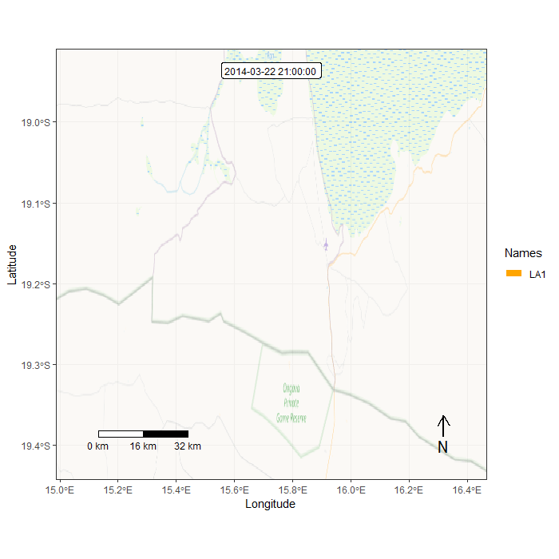

<body style="background-color:#fc9272;">

```{r, message = FALSE, error = FALSE, include = FALSE}
packages<-c("adehabitatHR","data.table","ggfortify","grid","move","moveVis","OpenStreetMap","ggplot2", "pbapply","plotly","rgdal","sp","tidyverse","viridis")
sapply(packages, require, character.only=T)
# install.packages("OpenStreetMap")
# install.packages("pbapply")
# library(pbapply)
# install.packages("adehabitatHR")
# library(adehabitatHR)
# library("maptools")
# library(rgdal)
# install.packages("gpclib")
# library(pbapply)
# require(pbapply)
# library(lme4)
# library(dplR)
# library(readr)
# library(ggplot2)
# library(patchwork)
# library(MuMIn)
# library(dplyr)
# library(ggplot2)
# library(gridExtra)
# install.packages("Rmisc")
# library(ggthemes)
# library(nlme)
# install.packages("Rtools")
# library(rgdal)
# library(maptools)
# if (!require(gpclib)) install.packages("gpclib", type="source")
# gpclibPermit()
```

```{r Packages, echo=TRUE, message=FALSE, warning=FALSE, include = FALSE}
packages2<-c("adehabitatHR","data.table","ggfortify","grid","move","moveVis","OpenStreetMap","pbapply","plotly","rgdal","sp","tidyverse","viridis")
sapply(packages2, library, character.only=T)

install.packages('pacman')
pacman::p_load("ggsn","leaflet","mapdata","maptools","OpenStreetMap","rgdal","tidyverse")
```

# Study Summary

The relationship between resource availability and wildlife movement patterns is pivotal to understanding species behavior and ecology. Movement response to landscape variables occurs at multiple temporal scales, from sub-diurnal to multiannual. Additionally, individuals may respond to both current and past conditions of resource availability. In this paper, we examine the temporal scale and variation of current and past resource variables that affect movement patterns of African elephants (*Loxodonta africana*) using sub-hourly movement data from GPS-GSM collared elephants in Etosha National Park, Namibia. We created detailed satellite-based spatiotemporal maps of vegetation biomass, as well as distance from surface water, road and fence. We used step selection functions to measure the relative importance of these landscape variables in determining elephants’ local movement patterns. We also examined how elephants respond to information, in locations they have previously visited, on productivity integrated over different temporal scales: from current to historical conditions. Our results demonstrate that elephants choose patches with higher-than average annual productivity and grass biomass, but lower tree biomass. Elephants also prefer to walk close to water, roads, and fences. These preferences vary with time of day and with season, thereby providing insights into diurnal and seasonal behavioral patterns and the ecological importance of the landscape variables examined. We also discovered that elephants respond more strongly to long-term patterns of productivity than to immediate forage conditions, in familiar locations. Our results illustrate how animals with high cognitive capacity and spatial memory integrate long-term information on landscape conditions. We illuminate the importance of long-term high temporal resolution satellite imagery to understanding the relationship between movement patterns and landscape structure.


</center>
Figure 1. Two African elephants (*Loxodonta africana*) in the African bush.

# Importing Dataset 

```{r}
elephants <- read.csv("elephants.csv")
head(elephants)
```

# Plotting Data

In order to be sure that the dataset contained no outliers, I plotted the data to interactively view the data.

```{r}
ele_plot <- ggplot() + geom_point(data=elephants, 
                                   aes(utm.easting,utm.northing,
                                       color=individual.local.identifier)) +
                        labs(x="Easting", y="Northing") +
                        guides(color=guide_legend("Identifier"))

colors <- c("LA1" = "#de2d26", "LA2" = "#fc9272", "LA3" = "#fec44f")


ele_plot <- ele_plot + scale_color_manual(values = colors)

ggplotly(ele_plot)
```

Then, I created a function and use the lapply command to apply a function over a list or vector dataset. This took the original dataset, split it into separate files based on the individual identifier, and created new *.csv files using the identifier as the filename.


```{r, warning = FALSE, error = FALSE}
lapply(split(elephants, elephants$individual.local.identifier), 
       function(x)write.csv(x, file = paste(x$individual.local.identifier[1],".csv", sep = ""), row.names = FALSE))

files <- list.files(path = ".", pattern = "[LA]+[0-9]+", full.names = TRUE)

files
```

# Simple Imagery Analysis 

I used the min/max x,y data to create a bounding box to retrieve the aerial imagery, then I reprojected the imagery back to the location in Africa.

```{r, error = FALSE, warning= FALSE}
utm_points <- cbind(elephants$utm.easting, elephants$utm.northing)

utm_locations <- SpatialPoints(utm_points, 
                 proj4string=CRS("+proj=utm +zone=47 +datum=WGS84"))

proj_lat.lon <- as.data.frame(spTransform(
                utm_locations, CRS("+proj=longlat +datum=WGS84")))

colnames(proj_lat.lon) <- c("x","y")

raster <- openmap(c(max(proj_lat.lon$y)+0.01, min(proj_lat.lon$x)-0.01), 
                  c(min(proj_lat.lon$y)-0.01, max(proj_lat.lon$x)+0.01), 
                  type = "bing")

raster_utm <- openproj(raster, 
              projection = "+proj=utm +zone=47 +datum=WGS84 +units=m +no_defs")
```

```{r}
simple <- autoplot.OpenStreetMap(raster_utm, expand = TRUE) + theme_bw() +
  theme(legend.position="bottom") +
  theme(panel.border = element_rect(colour = "black", fill=NA, size=1)) +
  geom_point(data=elephants, aes(utm.easting,utm.northing,
             color=individual.local.identifier), size = 2, alpha = 0.5) +
  theme(axis.title = element_text(face="bold")) + labs(x="Easting",
        y="Northing") + guides(color=guide_legend("Identifier"))

colors <- c("LA1" = "#de2d26", "LA2" = "#fc9272", "LA3" = "#fec44f")


simple + scale_color_manual(values = colors)
```

# Home Range Analysis 

## Minimum Convex Polygon

MCPs are common estimators of home range, but can potentially include area not used by the animal and overestimate the home range. 

```{r, warning = FALSE, error = FALSE}
#Run MCP for all individuals 
mcp_raster <- function(filename){
  data <- read.csv(file = filename)
  x <- as.data.frame(data$utm.easting)
  y <- as.data.frame(data$utm.northing)
  xy <- c(x,y)

data.proj <- SpatialPointsDataFrame(xy,data, proj4string = CRS("+proj=utm +zone=47 +datum=WGS84 +units=m +no_defs"))

  xy <- SpatialPoints(data.proj@coords)
  
  mcp.out <- mcp(xy, percent=100, unout="ha")
  
  mcp.points <- cbind((data.frame(xy)),data$individual.local.identifier)
  
  colnames(mcp.points) <- c("x","y", "identifier")
  
  mcp.poly <- fortify(mcp.out, region = "id")
  
  units <- grid.text(paste(round(mcp.out@data$area,2),"ha"), x=0.85,  y=0.95,
                     gp=gpar(fontface=4, col="white", cex=0.9), draw = FALSE)

  
  mcp.plot <- autoplot.OpenStreetMap(raster_utm, expand = TRUE) + theme_bw() + theme(legend.position="none") +
    theme(panel.border = element_rect(colour = "black", fill=NA, size=1)) +
    geom_polygon(data=mcp.poly, aes(x=mcp.poly$long, y=mcp.poly$lat), alpha=0.8) +
    geom_point(data=mcp.points, aes(x=x, y=y)) + 
    labs(x="Easting (m)", y="Northing (m)", title=mcp.points$identifier) +
    theme(legend.position="none", plot.title = element_text(face = "bold", hjust = 0.5)) + 
    annotation_custom(units)
  
  mcp.plot
}

pblapply(files, mcp_raster)
```

## Kernel-Density Estimation

A kernel uses a function to predict how likely use is for each pixel within a grid.

```{r}
kde_raster <- function(filename){
  data <- read.csv(file = filename)
  x <- as.data.frame(data$utm.easting)
  y <- as.data.frame(data$utm.northing)
  xy <- c(x,y)
  
data.proj <- SpatialPointsDataFrame(xy,data, proj4string = CRS("+proj=utm +zone=47 +datum=WGS84 +units=m +no_defs"))
  xy <- SpatialPoints(data.proj@coords)
  kde<-kernelUD(xy, h="href", kern="bivnorm", grid=100)
  ver <- getverticeshr(kde, 95)
  kde.points <- cbind((data.frame(data.proj@coords)),data$individual.local.identifier)
  colnames(kde.points) <- c("x","y","identifier")
  kde.poly <- fortify(ver, region = "id")
  units <- grid.text(paste(round(ver$area,2)," ha"), x=0.85,  y=0.95,
                     gp=gpar(fontface=4, col="white", cex=0.9), draw = FALSE)
  
  kde.plot <- autoplot.OpenStreetMap(raster_utm, expand = TRUE) + theme_bw() + theme(legend.position="none") +
    theme(panel.border = element_rect(colour = "black", fill=NA, size=1)) +
    geom_polygon(data=kde.poly, aes(x=kde.poly$long, y=kde.poly$lat), alpha = 0.8) +
    geom_point(data=kde.points, aes(x=x, y=y)) +
    labs(x="Easting (m)", y="Northing (m)", title=kde.points$identifier) +
    theme(legend.position="none", plot.title = element_text(face = "bold", hjust = 0.5)) + 
    annotation_custom(units)
  kde.plot
}

pblapply(files, kde_raster)
```

##  Brownian Bridge Movement

BBM incorporates temporal and behavioral characteristics of movement paths into estimation of home range.

```{r}
LA1 <- read.csv("LA1.csv")

date <- as.POSIXct(strptime(as.character(LA1$timestamp),"%m/%d/%Y %H:%M", tz="Africa/Abidjan"))

LA1$date <- date

LA1.reloc <- cbind.data.frame(LA1$utm.easting, LA1$utm.northing,
                                as.vector(LA1$individual.local.identifier),
                                as.POSIXct(date))

colnames(LA1.reloc) <- c("x","y","id","date")

trajectory <- as.ltraj(LA1.reloc, date=date, id="LA1")

sig1 <- liker(trajectory, sig2 = 58, rangesig1 = c(0, 5), plotit = FALSE)

la.traj <- kernelbb(trajectory, sig1 = .7908, sig2 = 58, grid = 100)

bb_ver <- getverticeshr(la.traj, 95)

bb_poly <- fortify(bb_ver, region = "id", 
                   proj4string = CRS("+proj=utm +zone=335+
                                     datum=WGS84 +units=m +no_defs"))

colnames(bb_poly) <- c("x","y","order","hole","piece","id","group")

bb_image <- crop(la.traj, bb_ver, 
                 proj4string = CRS("+proj=utm +zone=47 +
                                   datum=WGS84 +units=m +no_defs"))

bb_units <- grid.text(paste(round(bb_ver$area,2)," ha"), x=0.85,  y=0.95,
                   gp= gpar(fontface=4, col="white", cex=0.9), draw = FALSE)

bb.plot <- autoplot.OpenStreetMap(raster_utm, expand = TRUE) + theme_bw() + theme(legend.position="none") +
  theme(panel.border = element_rect(colour = "black", fill=NA, size=1)) +
  geom_tile(data=bb_image, 
            aes(x=bb_image@coords[,1], y=bb_image@coords[,2],
            fill = bb_image@data$ud)) +
  geom_polygon(data=bb_poly, aes(x=x, y=y, group = group), color = "orange", fill = NA) +
  scale_fill_viridis_c(option = "inferno") + annotation_custom(bb_units) +
  labs(x="Easting (m)", y="Northing (m)", title="LA1") +
  theme(legend.position="none", plot.title = element_text(face = "bold", hjust = 0.5))

bb.plot
```

## Animate Trajectory Data

```{r, warning = FALSE}
la.move <- move(x=LA1$location.long, 
             y=LA1$location.lat, 
             time=as.POSIXct(LA1$timestamp, 
                             format="%m/%d/%Y %H:%M", tz="Asia/Bangkok"), 
             proj=CRS("+proj=longlat +ellps=WGS84 +datum=WGS84"),
             data=LA1, animal=LA1$individual.local.identifier, 
             sensor=LA1$sensor.type)
```

```{r, error = FALSE, warning = FALSE}
movement <- align_move(la.move, res = "max", digit = 0, unit = "secs")
```

```{r}
median(timeLag(la.move, unit = "mins")) 

map_token = 'https://account.mapbox.com/access-tokens/Home.range.token'

map_token =  Sys.getenv('map_token') 

Sys.getenv('.Renviron')

get_maptypes()

frames <- frames_spatial(movement, path_colours = "orange",
                         map_type = "streets",
                         alpha = 0.5) %>% 
  add_labels(x = "Longitude", y = "Latitude") %>%
  add_northarrow() %>% 
  add_scalebar() %>% 
  add_timestamps(movement, type = "label") %>% 
  add_progress()

animate_frames(frames, fps = 5, overwrite = TRUE,
               out_file = "./moveVis-5fps.gif")

```

